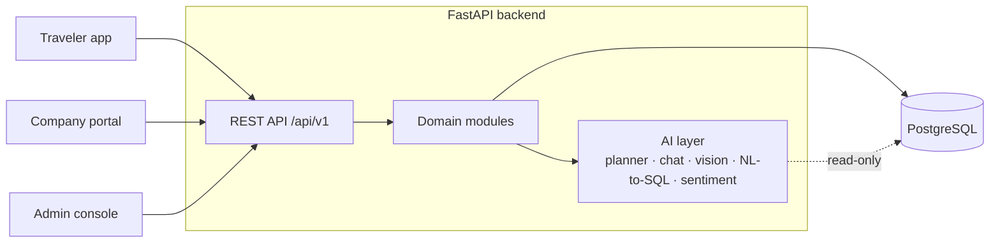

<div align="center">

# Egyptora

**An AI travel planner for Egypt: personalized itineraries, a conversational trip editor, monument recognition, and a marketplace where licensed tourism companies compete on price.**

[](https://github.com/HamdyElbauomi/Egyptora/actions/workflows/ci.yml)


</div>

---

## Overview

Planning a trip in Egypt usually means juggling blogs, booking sites, tour operators and guides. Egyptora turns a few
preferences (interests, budget, trip length, destinations) into a complete day-by-day itinerary. Travelers then refine it
in natural language, learn about monuments by pointing their camera at them, and compare hotel offers from competing
tourism companies.

This repository contains the **backend API** that powers the three Egyptora applications:

| App | Users | Purpose |
| --- | --- | --- |
| Traveler app | Tourists | Plan, edit, scan, search hotels, save and share trips |
| Company portal | Licensed tourism companies | Publish hotel offers, track market position, read reviews |
| Admin console | Egyptora team | Verify companies, manage the catalog, monitor AI quality |

## Features

**AI**

- **Trip planner agent:** builds a full itinerary from preferences, picking places, timing and the best hotel offer per night.
- **Conversational editing:** travelers change the plan in plain language. Every change comes with an explanation and its cost impact, and can be kept or undone.
- **Monument recognition:** a vision model identifies monuments from a photo and returns verified historical information. Follow-up questions are answered only from that verified source.
- **Natural-language hotel search:** questions like *"4-star in Luxor under 1,500 EGP with free cancellation"* are translated to SQL and run against a read-only view.
- **Review sentiment analysis:** summarizes traveler reviews into positive share and top complaints.

**Marketplace**

- Multiple companies sell the same hotel; travelers see **Lowest** and **Best value** offers side by side.
- A **trust score** blends an admin-verified starting score with traveler ratings as reviews accumulate.
- Companies see their market position and get alerts when a competitor undercuts them.

**Quality loop**

- Every AI search is logged. Failed queries are corrected by an admin and fed back as training examples.
- Low-confidence monument scans are reviewed and relabeled to improve the next model version.

## Architecture



- **Modular monolith:** each domain (accounts, trips, places, hotels, offers…) owns its models, schemas and routes.
- **AI behind a stable interface:** every AI capability is a plain function with a mock mode, so the API contract never changes when a model is swapped in.
- **Contract-first:** the OpenAPI spec at `/openapi.json` is the single source of truth for all three front ends.

## Tech stack

| Layer | Technology |
| --- | --- |
| API | FastAPI, Pydantic v2 |
| Database | PostgreSQL 16, SQLAlchemy 2.0, Alembic |
| Auth | JWT (access + refresh tokens), role-based access |
| AI | LLM agents, computer vision, NL-to-SQL, sentiment analysis |
| Quality | pytest, Ruff, GitHub Actions |
| Dev environment | Docker Compose |

## Getting started

**Prerequisites:** Python 3.11+, Docker.

```bash
git clone https://github.com/HamdyElbauomi/Egyptora.git
cd Egyptora

python -m venv .venv
source .venv/bin/activate        # Windows: .venv\Scripts\activate
pip install -r requirements-dev.txt
cp .env.example .env             # Windows: copy .env.example .env

docker compose up -d db
alembic upgrade head
python -m scripts.seed

uvicorn app.main:app --reload
```

Interactive API docs: **http://localhost:8000/docs**

Sample accounts (development only, password `egyptora123`): `admin@egyptora.dev`, `traveler1@egyptora.dev`, `sunrise@egyptora.dev`.

## Configuration

Settings are read from environment variables or `.env`:

| Variable | Description | Default |
| --- | --- | --- |
| `DATABASE_URL` | PostgreSQL connection string | local Docker database |
| `READONLY_DATABASE_URL` | Read-only connection used for AI-generated SQL | falls back to `DATABASE_URL` |
| `JWT_SECRET` | Secret used to sign tokens | development value |
| `AI_MOCK` | Return sample AI responses instead of calling models | `true` |
| `EXPOSE_AI_ROUTES` | Expose `/api/v1/ai/*` endpoints for testing | `true` |
| `LLM_API_KEY` | API key for the language model provider | — |

## Project structure

```
app/
├── core/          configuration, database, security, shared dependencies
├── ai/            planner, chat agent, recognizer, place Q&A, NL-to-SQL, sentiment
├── modules/
│   ├── accounts/      users and authentication
│   ├── companies/     companies, reviews, trust score
│   ├── catalog/       cities and interests
│   ├── trips/         trips, days, items, generation
│   ├── chat/          conversational trip editing
│   ├── sharing/       summaries and share links
│   ├── places/        places, images, monument scans
│   ├── hotels/        hotels and natural-language search
│   ├── offers/        offers, ranking, price alerts
│   ├── ai_quality/    query logs and training examples
│   └── admin_stats/   platform overview
└── main.py        application entry point
migrations/        Alembic migrations
scripts/           seed data and database setup
tests/             test suite
```

## Testing

```bash
pytest                              # test suite (uses a separate egyptora_test database)
ruff check . && ruff format --check .
alembic check                       # models and migrations are in sync
```

All three run on every pull request.

## Status

Under active development as a graduation project at the Faculty of Engineering, Mansoura University.
The full API surface, database schema, authentication and CI are in place; feature endpoints and AI models are being implemented.
